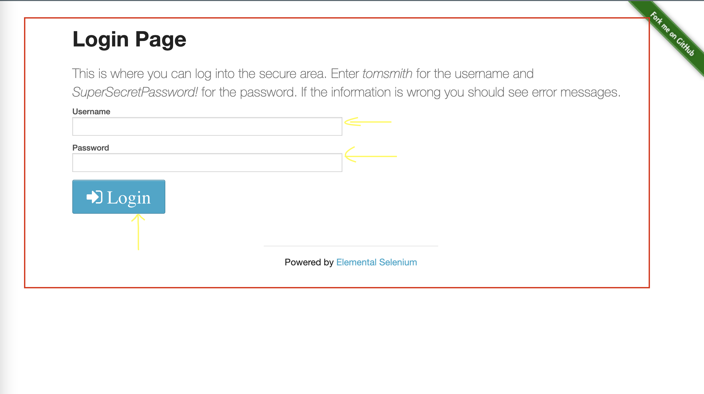
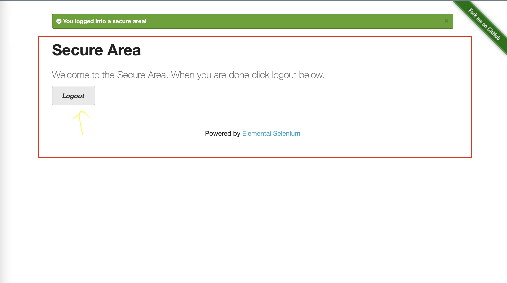
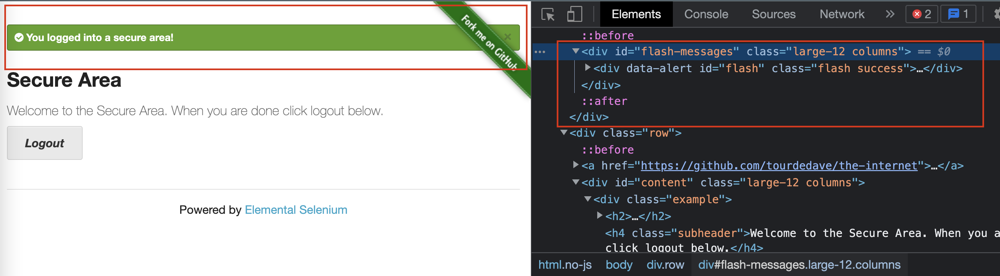

# webdriverio_playground

## Getting started

Install dependencies with command:

> `npm install`

Run tests with command:

> `npm run wdio`

Run tests with debugger attached in `vscode`

> see `.vscode/launch.json` configurations objects

## Tasks Iteration #1: write e2e test

Examples are hosted at [the-internet](https://the-internet.herokuapp.com/) :)  
Github repo is [https://github.com/saucelabs/the-internet](https://github.com/saucelabs/the-internet)

- [x] Write test for :point_right: [Checkboxes](https://the-internet.herokuapp.com/checkboxes)
- [x] Write test for :point_right: [Inputs](https://the-internet.herokuapp.com/inputs)
- [x] Write test for :point_right: [Key Presses](https://the-internet.herokuapp.com/key_presses?)
- [x] Write test for :point_right: [JavaScript Alerts](https://the-internet.herokuapp.com/javascript_alerts)
- [x] Write test for :point_right: [Hovers](https://the-internet.herokuapp.com/hovers)
- [x] Write test for :point_right: [Dynamic Loading](https://the-internet.herokuapp.com/dynamic_loading)
- [x] Write test for :point_right: [Dropdown](https://the-internet.herokuapp.com/dropdown)
- [x] Write test for :point_right: [Drag and Drop](https://the-internet.herokuapp.com/drag_and_drop)
- [x] Write test for :point_right: [Add Remove Elements](https://the-internet.herokuapp.com/add_remove_elements/)
- [x] Write test for :point_right: [Redirector](https://the-internet.herokuapp.com/redirector)
- `EXAMPLE IS NOT WORKING` Write test for :point_right: [Slow resources](https://the-internet.herokuapp.com/slow)
- [x] Write test for :point_right: [Frames](https://the-internet.herokuapp.com/frames)
- [x] Write test for :point_right: [Windows](https://the-internet.herokuapp.com/windows)
- [x] Write test for :point_right: [File upload](https://the-internet.herokuapp.com/upload)
- [x] Write test for :point_right: [Exit intent](https://the-internet.herokuapp.com/exit_intent)

## Tasks Iteration #2: write e2e test using page objects

Write test for Login functionality 
- [x] Write test for :point_right: [Login](https://the-internet.herokuapp.com/login)

:point_down: 

Write same test for Login functionality but now _using Page Objects_ 
- [] Write  :point_right: 
- [] Write  :point_right: 
- [] 

Steps of the process 
1. test the functionality manually 
2. write down test scenarios / test cases 
  ```
  Test scenario 1: user should be able to login successfully with valid credentials
    1 set username and VALID password => tomsmith/SuperSecretPassword!
    2 click LOGIN button 
    3 expect to be navigated to URL /secure
    4 expect SUCCESS message to be in viewport 

  Test scenario 2: user should NOT be able to login with invalid credentials
    1 set username and INVALID password => tomsmith/bla
    2 click LOGIN button 
    3 expect ERROR message to be in viewport 
  ```
3. detect pages and components in UI (in viewport) that represent different PAGE OBJECTS
  - `LoginPage` page object (url matches `/login`)
    
    ```
    css selectors: 
    'input#username'
    'input#password' 
    'button[type="submit"]'
    ^^ these 3 will be 3 fields on our LoginPage class  
    LoginPage class will represent our first page object 
    ```

  - `SecurePage` page object (url matches `/secure`)
    
    ```
    css selectors: 
    'a[href="/logout"]'
    ^^ this will be 1 field on our SecurePage class  
    SecurePage class will represent our second page object 
    ```

  - `FlashMessage` page object (common functionality)
    
    ```
    css selectors: 
    'div#flash-messages > div[class="flash success"]'
    'div#flash-messages > div[class="flash error"]'
    ^^ these two will be 2 fields on our FlashMessage class  
    FlashMessage class will represent our third page object 
    note that this functionality is common and reused across different pages 
    ```

4. write page objects code (3 files, one class per file)
  - ./test_v2/pageobjects/LoginPage.ts -> `class LoginPage { ... }`
  - ./test_v2/pageobjects/SecurePage.ts -> `class SecurePage { ... }`
  - ./test_v2/pageobjects/FlashMessage.ts -> `class FlashMessage { ... }`

5. go back to test script (`./test_v2/specs/login.page_objects.e2e.ts` file)
   and try to replace existing steps with equivalent lines that relay on Page Object class methods instead 

**Bookmarks:** 
 - Select an element in DOM using CSS selectors -> [CSS cheatsheet](https://devhints.io/css)  
 - Select an element in DOM using XPath selectors -> [XPath cheatsheet](https://devhints.io/xpath)  

## WDIO Example with LoginPage: go through example code to understand benefits of the solution with page objects

- [ ] Write test for :point_right: [Login](https://the-internet.herokuapp.com/login)

  - [ ] Design a page object that represents any `Page`
    - we are creating a class `Page` in `./test/pageobjects/page.ts`
    - each `*Page` class will extend from base `Page` class
    - base `Page` class should provide the functionality that is **common** to all `*Page` pages
      ```
      class Page {
        ...
        public open(path: string) {
          return browser.url(`https://the-internet.herokuapp.com/${path}`)
        }
      }
      ```
  - [ ] Design a page object that represents `LoginPage` (this is first example of `*Page` class)

    - we are creating a class `LoginPage` in `./test/pageobjects/login.page.ts`
    - `LoginPage` will overwrite `Page`'s `open` method to fit it's needs

      ```
      class LoginPage extends Page {
        ...
        public open() {
          // super.open just means "call open method on parent's class"
          // Page is that parent class and in line below we actually call Page's open method
          // passing the value "login" for parameter "path"
          return super.open("login")
        }
      }

      ```

  - TODO ... :construction:
